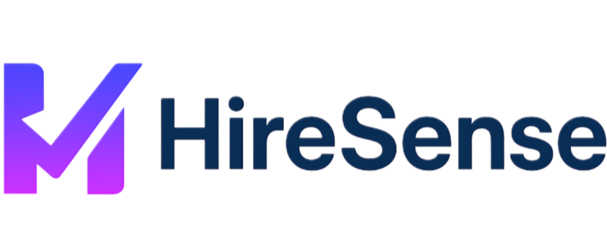
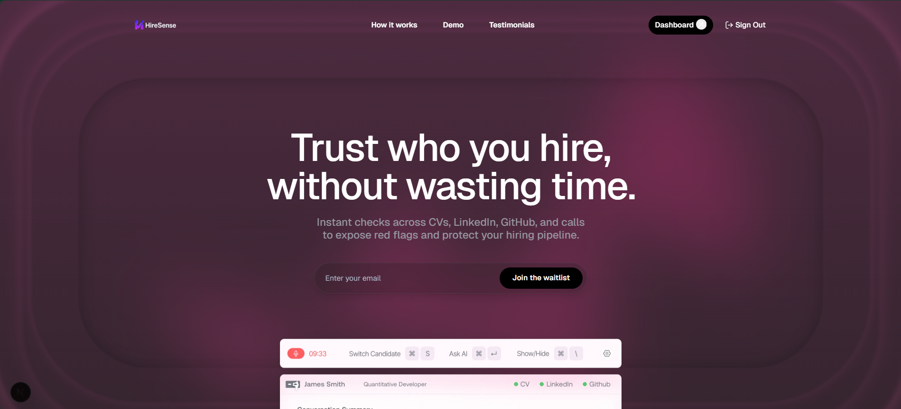
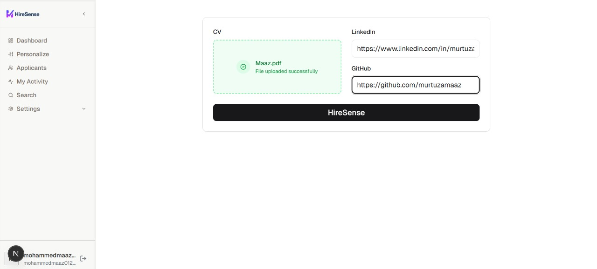
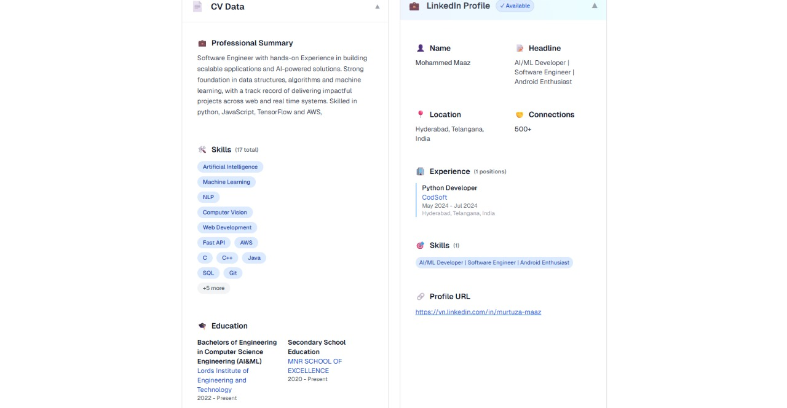
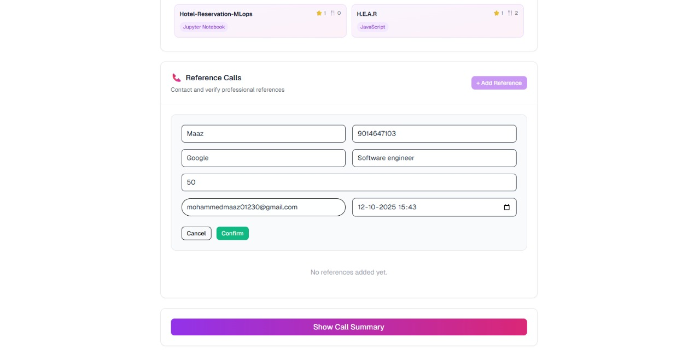

  

# HireSense: Hire with Certainty and Heart

**Beyond resumes, beyond interviews—discover the truth.**

HireSense is a truth engine for hiring. In a world of curated resumes, we empower you to uncover the authentic story of every candidate. By intelligently cross-validating their digital footprint and conducting empathetic, AI-powered interviews, we replace uncertainty with undeniable proof. HireSense gives you the confidence to not only hire the most skilled individual but to welcome the right person into your team—a person you can trust to build the future with.

## 🚀 Live Demo

**[Insert Live Demo Link Here]**

## ✨ Key Features

### 🧬 Unified Candidate Story

Instead of scattered documents, see a single, verified narrative. HireSense automatically:

- **Cross-Validates Digital Footprints:** Seamlessly analyzes and compares CVs, LinkedIn profiles, and GitHub activity to surface the real story.
- **Flags Inconsistencies:** Instantly highlights discrepancies that matter, saving you from manual fact-checking and doubt.

### 🎙️ Empathetic AI Interviews

Go beyond keyword matching with conversational AI that understands nuance and character.

- **AI-Powered Candidate & Reference Calls:** Conducts natural, in-depth interviews with both candidates and their references to gather unbiased, truthful insights.
- **Deep Transcript Analysis:** Doesn't just transcribe—it analyzes tone, confidence, and sentiment to give you a richer understanding of the person behind the profile.

### 🎯 The Certainty Score

Move beyond gut feelings with a single, trustworthy metric.

- **Holistic Credibility Rating:** Our unique AI model generates a "Certainty Score" based on verified data and interview analysis, giving you an at-a-glance measure of candidate reliability.
- **Actionable Insights:** Surfaces not just red flags, but also hidden strengths and positive signals, enabling truly data-driven decisions.

### Seamless ATS Integration

Embed certainty directly into your existing workflow.

- **Effortless Ashby Sync:** Keep your ATS as the source of truth while enriching it with HireSense's deep verification data.
- **Focus on People, Not Paperwork:** By automating the verification process, we free you to focus on what truly matters: building human connections.

## 🛠️ Technology Stack

- **Frontend:** Next.js, TypeScript, Tailwind CSS, Radix UI, Framer Motion
- **Backend:** Supabase, PostgreSQL, pg_cron
- **AI & Analysis:** Groq API, OpenAI GPT-4, ElevenLabs
- **Infrastructure:** Docker, Vultr

## 🖼️ Screenshots

  
   
  <em>Landing Page</em>
   
   
  
   
  <em>Candidate Dashboard</em>
   
   
  
   
  <em>AI-Powered Analysis</em>
   
   
  
   
  
  <em>Automated Reference Calls</em>

## 👥 Team

HireSense was developed by a passionate team of builders:

Mohammed Huzaifah
Mohammed Murtaza uddin Maaz
Syed Numaan
Syed Abdul Muqeet Mujeeb
